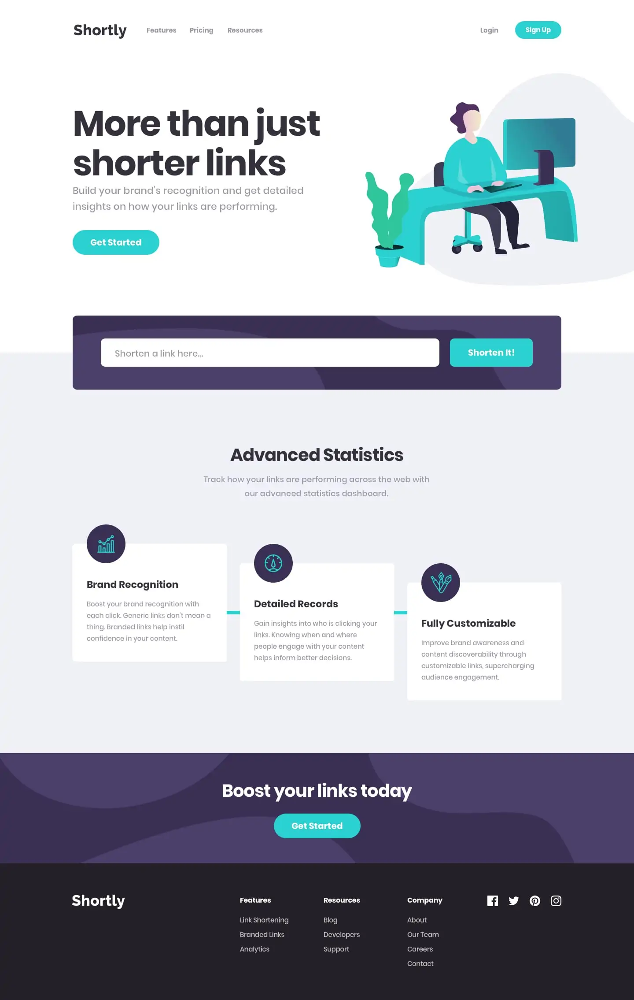

# Frontend Mentor - Shortly URL shortening API Challenge solution

This is a solution to the [Shortly URL shortening API Challenge challenge on Frontend Mentor](https://www.frontendmentor.io/challenges/url-shortening-api-landing-page-2ce3ob-G). 

## Table of contents

- [Overview](#overview)
  - [The challenge](#the-challenge)
  - [Screenshot](#screenshot)
  - [Links](#links)
- [My process](#my-process)
  - [Built with](#built-with)
  - [What I learned](#what-i-learned)
  - [Continued development](#continued-development)
- [Author](#author)
- [Acknowledgments](#acknowledgments)

## Overview

### The challenge

Users should be able to:

- View the optimal layout for the site depending on their device's screen size
- Shorten any valid URL
- See a list of their shortened links, even after refreshing the browser
- Copy the shortened link to their clipboard in a single click
- Receive an error message when the `form` is submitted if:
  - The `input` field is empty

### Screenshot



### Links

- Solution URL: https://github.com/AlbertQR/url-shortening-front-react
- Live Site URL: https://albertqr.github.io/url-shortening-front-react

## My process

### Built with

- Semantic HTML5 markup
- CSS custom properties
- [Tailwind CSS](https://tailwindcss.com/) 
- [React](https://reactjs.org/) - JS library

### What I learned

Was a challenge first because I'm used to work with React and Tailwind, 
so I had to find how to solve some problems got in the way like add new 
utilities to Tailwind.  

```js
plugins: [
  function ({ addUtilities }) {
    addUtilities({
      '.empty-content': {
        content: ''
      }
    });
  }
],
```

### Continued development

From the beginning i through this project like a full-stack challenge 
so this is not the end I'll keep improving and  adding functionalities 
to the project and build a whole service included an own backend and 
user login  and the administration section solution.

## Author

- Github: - [@AlbertQR](https://github.com/AlbertQR/)
- Frontend Mentor - [@AlbertQR](https://www.frontendmentor.io/profile/AlbertQR)

## Acknowledgments

This is where you can give a hat tip to anyone who helped you out on 
this project. Perhaps you worked in a team or got some inspiration from 
someone else's solution. This is the perfect place to give them some credit.
